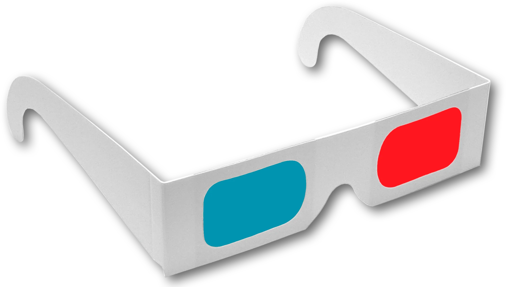

# Photo Blog

A Quarto-based static photography site designed for GitHub Pages deployment.

The site has:

- a homepage with a short welcome intro
- a separate `About Me` page
- one preview card per gallery category
- one generated page per gallery category
- a simple top banner with a logo and gallery menu
- a static `docs/` output folder for publishing

## Purpose

This repository is set up to make gallery management simple:

- add images to `img/<category>/thumbnail` and `img/<category>/full`
- update `data/galleries.json`
- run Quarto
- let the generator create the homepage cards, header menu, manifest, and gallery pages automatically

The current workflow is optimized for a small-to-medium personal photography site where categories change occasionally and image collections grow over time.

## Requirements

To build the site locally, you need:

- Quarto
- Python 3

Python is required because the site uses a pre-render script, [scripts/build_photo_manifest.py](/Users/adrianstevejoseph/Documents/repos/photo_blog/scripts/build_photo_manifest.py), to generate gallery pages and shared site fragments before Quarto renders the site.

No third-party Python packages are required. The script uses only the Python standard library.

## Project Structure

```text
photo_blog/
├── _quarto.yml
├── README.md
├── _content/
│   └── gallery-intros/
│       ├── animals.md
│       └── landscapes.md
├── data/
│   └── galleries.json
├── about.qmd
├── index.qmd
├── anaglyph.qmd
├── animals.qmd
├── cityscapes.qmd
├── landscapes.qmd
├── things.qmd
├── assets/
│   ├── images/site/
│   │   ├── logo.png
│   │   └── 3D_lenses.png
│   └── styles/
│       └── site.css
├── img/
│   ├── anaglyph/
│   │   ├── full/
│   │   └── thumbnail/
│   ├── animals/
│   │   ├── full/
│   │   └── thumbnail/
│   ├── cityscapes/
│   │   ├── full/
│   │   └── thumbnail/
│   ├── landscapes/
│   │   ├── full/
│   │   └── thumbnail/
│   └── things/
│       ├── full/
│       └── thumbnail/
├── scripts/
│   └── build_photo_manifest.py
├── _generated/
│   ├── category-cards.qmd
│   ├── photo-manifest.js
│   └── site-header.html
└── docs/
```

## Architecture

### 1. Quarto config

The main site configuration is in [_quarto.yml](/Users/adrianstevejoseph/Documents/repos/photo_blog/_quarto.yml).

It controls:

- output to `docs/`
- the pre-render step
- site resources copied into the build
- favicon
- global CSS
- the generated shared header included before page content

The generated header currently includes:

- a logo link back to `index.html`
- a dedicated `About Me` nav link
- a `Galleries` dropdown populated from `data/galleries.json`

### 2. Content pages

The page sources are:

- [index.qmd](/Users/adrianstevejoseph/Documents/repos/photo_blog/index.qmd): homepage
- [about.qmd](/Users/adrianstevejoseph/Documents/repos/photo_blog/about.qmd): About page
- [anaglyph.qmd](/Users/adrianstevejoseph/Documents/repos/photo_blog/anaglyph.qmd)
- [animals.qmd](/Users/adrianstevejoseph/Documents/repos/photo_blog/animals.qmd)
- [cityscapes.qmd](/Users/adrianstevejoseph/Documents/repos/photo_blog/cityscapes.qmd)
- [landscapes.qmd](/Users/adrianstevejoseph/Documents/repos/photo_blog/landscapes.qmd)
- [things.qmd](/Users/adrianstevejoseph/Documents/repos/photo_blog/things.qmd)

The category pages are generated automatically. Do not hand-edit them unless you plan to stop generating them.

If you want custom intro text on a gallery page, do not edit the generated `*.qmd` file. Put the text in `_content/gallery-intros/<slug>.md` instead.

### 3. Generator

The generator is [scripts/build_photo_manifest.py](/Users/adrianstevejoseph/Documents/repos/photo_blog/scripts/build_photo_manifest.py).

It runs before every Quarto build and is responsible for:

- reading `data/galleries.json`
- building `_generated/photo-manifest.js`
- building `_generated/category-cards.qmd`
- building `_generated/site-header.html`
- generating one category page source per gallery
- pulling in optional gallery intro copy from `_content/gallery-intros/<slug>.md`

It also uses stable deterministic preview image selection and write-on-change behavior so Quarto preview does not constantly reload.

### 4. Generated files

Files in [_generated](/Users/adrianstevejoseph/Documents/repos/photo_blog/_generated) are build support files.

They should be treated as generated artifacts:

- [category-cards.qmd](/Users/adrianstevejoseph/Documents/repos/photo_blog/_generated/category-cards.qmd): homepage gallery cards
- [photo-manifest.js](/Users/adrianstevejoseph/Documents/repos/photo_blog/_generated/photo-manifest.js): category/file list for gallery pages
- [site-header.html](/Users/adrianstevejoseph/Documents/repos/photo_blog/_generated/site-header.html): shared top banner

### 5. Published output

The built site lives in [docs](/Users/adrianstevejoseph/Documents/repos/photo_blog/docs).

For GitHub Pages, this is the folder that should be published.

### 6. Data manifest

The site is driven by [data/galleries.json](/Users/adrianstevejoseph/Documents/repos/photo_blog/data/galleries.json).

This file is the source of truth for:

- gallery slugs
- gallery labels
- gallery order
- homepage gallery thumbnails
- thumbnail image paths
- full-size image paths
- image titles
- image captions
- image order

Gallery intro prose is intentionally not stored in the JSON manifest. That content is easier to maintain as Markdown snippets under `_content/gallery-intros/`.

You can control display order by adding an `order` field:

- `galleries[].order`
- `galleries[].images[].order`

If two items share the same `order`, the site does not break. The generator uses deterministic fallback sorting:

- galleries: `order`, then `label`, then `slug`
- images: `order`, then `title`, then `thumb`, then `full`

## Image Organization

Each gallery category must follow this structure:

```text
img/<category>/
├── thumbnail/
└── full/
```

Rules:

- `thumbnail/` contains homepage/gallery thumbnails
- `full/` contains the matching full-size images
- filenames must match between `thumbnail/` and `full`

Example:

```text
img/animals/thumbnail/fox.jpg
img/animals/full/fox.jpg
```

## How To Change Key Things

### Change colors

Edit the CSS variables at the top of [assets/styles/site.css](/Users/adrianstevejoseph/Documents/repos/photo_blog/assets/styles/site.css#L1).

The main ones are:

- `--gallery-bg`: overall page background
- `--gallery-surface`: card surfaces
- `--gallery-ink`: main text color
- `--gallery-accent`: hover/accent color
- `--gallery-frame`: white image border color

### Change fonts

The site currently uses the Quarto theme defaults plus custom CSS styling.

To change typography:

1. Add a font import or font-face declaration to [assets/styles/site.css](/Users/adrianstevejoseph/Documents/repos/photo_blog/assets/styles/site.css)
2. Apply `font-family` to `body`, headings, or specific components

Typical places to adjust:

- `body`
- `.site-header__link`
- `.site-menu__summary`
- `.category-card__title`

### Change overall styling/layout

Main styling lives in [assets/styles/site.css](/Users/adrianstevejoseph/Documents/repos/photo_blog/assets/styles/site.css).

### Add or edit gallery intro text

Create or edit:

- `_content/gallery-intros/animals.md`
- `_content/gallery-intros/landscapes.md`
- `_content/gallery-intros/cityscapes.md`

Use the gallery slug as the filename. If a file exists, it will be included at the top of that gallery page. If it does not exist, the site falls back to the default instruction text.

This is the preferred place to write personal notes or context for a gallery. Avoid editing the generated root-level gallery `.qmd` files directly.

For images inside these intro files, use standard Quarto image attributes to control size, for example:

```md
{width=260px}
```

You can change `width` to any value that suits the layout.

Important sections:

- header/banner: `.site-header*`
- about section: `.about-section*`
- homepage intro/content: `index.qmd`
- homepage cards: `.category-card*`
- gallery grid: `.photo-grid`, `.photo-thumb`
- modal viewer: `.gallery-modal*`

### Change the homepage text

Edit [index.qmd](/Users/adrianstevejoseph/Documents/repos/photo_blog/index.qmd).

This is where you change:

- the homepage title
- the welcome text
- the short About-page link
- the order of homepage sections

### Change the About page

Edit [about.qmd](/Users/adrianstevejoseph/Documents/repos/photo_blog/about.qmd).

This is where you change:

- the About page title and body text
- the portrait image reference
- the `Back to Home` link text

### Change the logo or favicon

Replace:

- [assets/images/site/logo.png](/Users/adrianstevejoseph/Documents/repos/photo_blog/assets/images/site/logo.png)

This file is used for:

- the favicon
- the banner logo

If you rename it, update [_quarto.yml](/Users/adrianstevejoseph/Documents/repos/photo_blog/_quarto.yml#L11) and [scripts/build_photo_manifest.py](/Users/adrianstevejoseph/Documents/repos/photo_blog/scripts/build_photo_manifest.py#L87).

### Change the About image

Replace or edit:

- [assets/images/site/3D_lenses.png](/Users/adrianstevejoseph/Documents/repos/photo_blog/assets/images/site/3D_lenses.png)

If you rename it, update [index.qmd](/Users/adrianstevejoseph/Documents/repos/photo_blog/index.qmd#L7).
If you rename it, update [about.qmd](/Users/adrianstevejoseph/Documents/repos/photo_blog/about.qmd#L7).

## How To Add A Gallery

1. Create a new category folder under `img/`.
2. Add both `thumbnail/` and `full/` subfolders.
3. Add matching filenames to both folders.
4. Add a gallery entry to [data/galleries.json](/Users/adrianstevejoseph/Documents/repos/photo_blog/data/galleries.json).
5. Include:
   - `slug`
   - `label`
   - `order`
   - `home_thumbnail`
   - `images[].thumb`
   - `images[].full`
   - optional `images[].title`
   - optional `images[].caption`
   - optional `images[].order`
6. Run:

```bash
quarto render
```

The generator will automatically:

- add it to the `Galleries` dropdown
- add a homepage preview card
- generate a new page source like `<category>.qmd`
- publish a new page in `docs/<category>.html`

## How To Remove A Gallery

1. Remove the gallery entry from [data/galleries.json](/Users/adrianstevejoseph/Documents/repos/photo_blog/data/galleries.json).
2. Optionally remove the matching folder from `img/`.
3. Run:

```bash
quarto render
```

The generator will automatically stop emitting that gallery page and remove old generated category page sources it manages.

## How Category Names Are Derived

Category labels are now taken directly from [data/galleries.json](/Users/adrianstevejoseph/Documents/repos/photo_blog/data/galleries.json), not inferred from folder names.

That means you can control:

- gallery display labels
- gallery order
- homepage thumbnail selection
- image order

## Build And Preview

Render the site with:

```bash
quarto render
```

The rendered files are written to `docs/`.

If using Quarto preview and you ever see reload instability, restart the preview after structural changes. The current generator is designed to minimize unnecessary file rewrites.

## Deployment

This repo is set up for GitHub Pages deployment from the `docs/` directory.

Important points:

- `docs/` should stay committed
- `.gitignore` does not exclude `docs/`
- Quarto renders directly into `docs/`

To publish the site to GitHub Pages, use:

```bash
quarto publish gh-pages
```

This project has previously been published via Quarto's `gh-pages` workflow, so this is the command to use when republishing the live site.

## Notes For Future Maintenance

- Keep route pages simple and clearly named at the repo root.
- Keep generated support files in `_generated/`.
- Keep static assets in `assets/`.
- Avoid adding JavaScript navigation overrides unless there is a strong reason; plain links have been much more reliable in this project.
