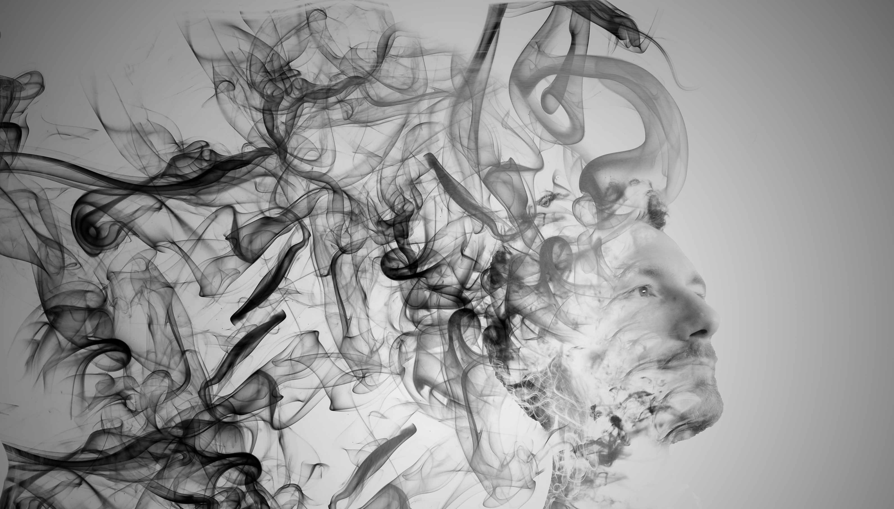

::: {.about-section}
I’m an amateur photographer, or more accurately someone who enjoys experimenting with a camera while spending time outdoors. Photography, for me, is less about chasing perfection and more about paying attention: to light, to small details, and to the everyday environments I might otherwise overlook. It gives structure to my time outside and turns ordinary moments into something worth observing more closely.

My work focuses mainly on nature: landscapes, animals, and quiet scenes that do not usually make headlines. There are no extreme expeditions or rare, far-flung subjects here. Most images come from familiar places and common encounters, with the occasional visit to a zoo for subjects I would not otherwise see. This is not a collection of technically perfect or award-winning photographs taken with high-end gear, but rather a body of work I am genuinely proud of, images that reflect patience, curiosity, and the simple effort of showing up and trying.
:::

<a class="about-backlink" href="index.html">Back to Home</a>

